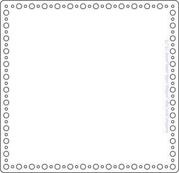

# Lego Sorter Using Odd Box Extra Small Box As Base

## formats

### a4_1_base
* link: [/a4_1_base](a4_1_base)  
  
* width:   
* height:   
* thickness:   
* material:   
 

### a4_2_15_mm_hole
* link: [/a4_2_15_mm_hole](a4_2_15_mm_hole)  
  
* width:   
* height:   
* thickness:   
* material:   
 

### a4_3_20_mm_hole
* link: [/a4_3_20_mm_hole](a4_3_20_mm_hole)  
  
* width:   
* height:   
* thickness:   
* material:   
 

### a4_4_30_mm_hole
* link: [/a4_4_30_mm_hole](a4_4_30_mm_hole)  
  
* width:   
* height:   
* thickness:   
* material:   
 

### a4_5_40_mm_hole
* link: [/a4_5_40_mm_hole](a4_5_40_mm_hole)  
  
* width:   
* height:   
* thickness:   
* material:   
 

### a4_6_160_mm_hole
* link: [/a4_6_160_mm_hole](a4_6_160_mm_hole)  
  
* width:   
* height:   
* thickness:   
* material:   
 

### tileable
* link: [/tileable](tileable)  
  
* width: 629 mm  
* height: 419 mm  
* thickness:   
* material:   
 
