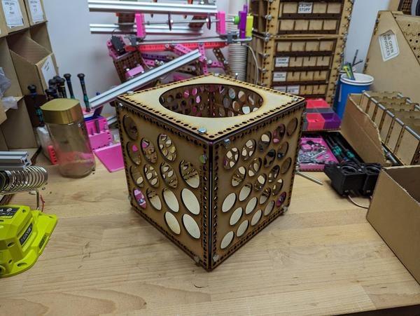
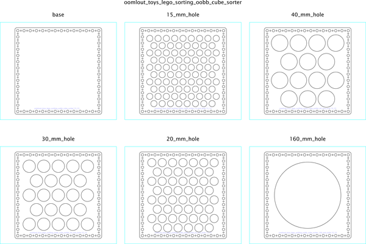

# Lego Sorter Using OOBB Cube Corners
A Lego sorter using OOBB cube corners.  
A cube for sorting lego by size! Size 15 x 15 oobb sides, 4 with sides of varying sizes. Used eight oobb corner cubes and 24 m6 x 26 bolts for asesmbly. ( https://github.com/oomlout/oomlout_oobb_version_4/tree/main/things/oobb_other_02_02_29_ex_corner_cube )  

## corel working
 

